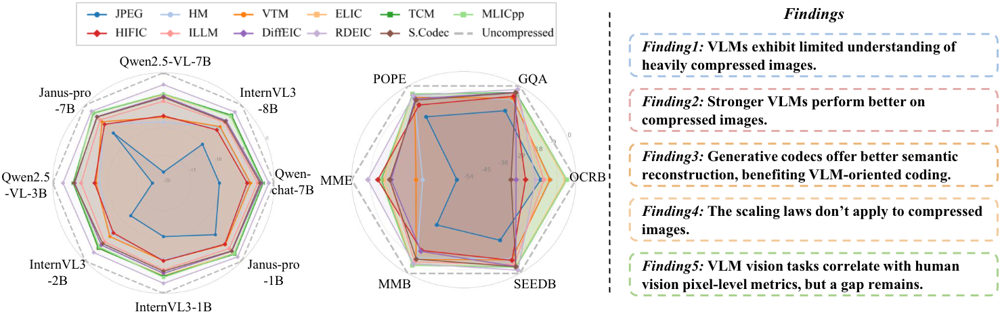
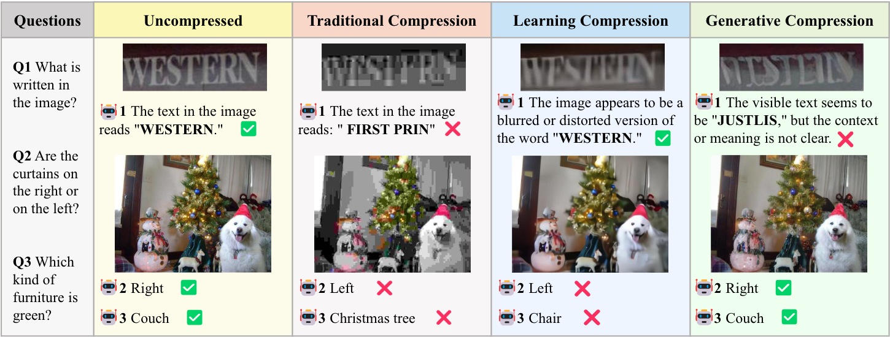
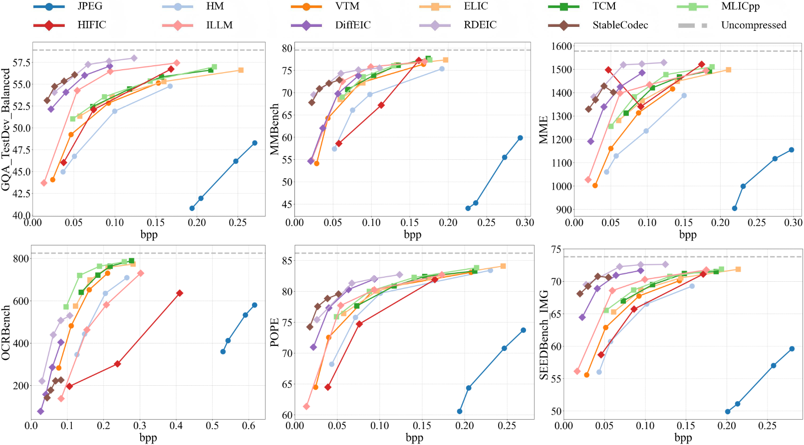

<div align="center">

# Benchmarking and Enhancing VLM for Compressed Image Understanding

### **ICML 2026**

<!-- [Project Page](https://logosroboticsgroup.github.io/MoLA) | [Paper](https://arxiv.org/abs/2605.12167) | [Checkpoints](https://huggingface.co/LeeLiaoLiao/MoLA-ckpt) -->

Zifu Zhang, Tongda Xu, Siqi Li, Shengxi Li, Yue Zhang, Mai Xu, Yan Wang

</div>


This repo contains training and evaluation code for the paper "[Benchmarking and Enhancing VLM for Compressed Image Understanding]"
If you like our project, please give us a star ⭐ on GitHub for latest update.



## Introduction

We present a comprehensive benchmark designed to evaluate the ability of VLMs to understand and process compressed images. Our benchmark includes 11 widely-used codecs and 3 series of VLMs, ranging from 1 to 32 billion parameters, and assesses both coarse-grained and fine-grained metrics across more than 1 million compressed images. This large-scale analysis allows us to quantify the performance degradation of VLMs due to image compression, revealing that compression can significantly impair the model's ability to interpret visual content, as reflected in the subjective examples. Based on this, we further break down the observed performance gap into two distinct components: the information gap during compression, which directly impacts the fidelity of image features, and the generalization gap of VLMs, which limits their ability to adapt to compressed images. Through visualizations and examples, we show that while the loss of information during compression is inherent and cannot be easily mitigated, the generalization gap represents a gap that can be addressed by improving the model’s ability to handle compressed inputs. To close this generalization gap, we propose a lightweight VLM adaptor that enhances VLM performance on compressed images across diverse codecs and bitrate levels. Empirical results demonstrate that the proposed adapter consistently improves compressed-image understanding by 10%--30% under different compression settings, indicating its strong generalization capability across codec types and compression levels. These results suggest that our method provides a practical and scalable solution for real-world VLM applications involving compressed visual inputs.



## Benchmark Evaluation

We use the [VLMEvalKit](https://github.com/open-compass/vlmevalkit) to evaluate the performance of VLMs on compressed images. Additionally we use the `CompressVLMBench/CompressMethods` which includes 11 widely-used codecs.

All evaluation results are organized in the `CompressVLMBench/Benchmark` folder, covering various VLMs, bitrate points, and evaluation metrics. The baseline results on uncompressed images are stored in the `CompressVLMBench/VLMEvalKit/outputs` folder. We also provide a reference evaluation script to facilitate reproduction and further experimentation.

```bash
bash ./VLMEvalKit/parallel_run_InternVL3_2B.sh
```




## Enhancement

We use compressed COCO images for training. If you wish to fine-tune a VLM, you should first download the COCO dataset, then compress it using `CompressVLMBench/CompressMethods`, and finally apply fine-tuning to enhance VLM robustness on compressed inputs. A reference fine-tuning script is provided below.

```bash
bash ./Enhance/finetune.sh
```

The saved checkpoint only has the state dict of vision encoder and you need to combine with the original VLM checkpoint using `CompressVLMBench/Enhance/combine_pth.py`. And then you can resigister your own model in `CompressVLMBench/VLMEvalKit/config.py` like `"Qwen2.5-VL-3B-Instruct-Codec": partial(Qwen2VLChat, model_path="/path/to/your/checkpoint")`. Based on the new model you can run the evaluation script.


## Citation

**BibTeX:**
```bibtex
@article{chow2025physbench,
  title={Benchmarking and Enhancing VLM for Compressed Image Understanding},
  author={Zifu Zhang, Tongda Xu, Siqi Li, Shengxi Li, Yue Zhang, Mai Xu, Yan Wang},
  journal={ICML 2026},
  year={2026}
}